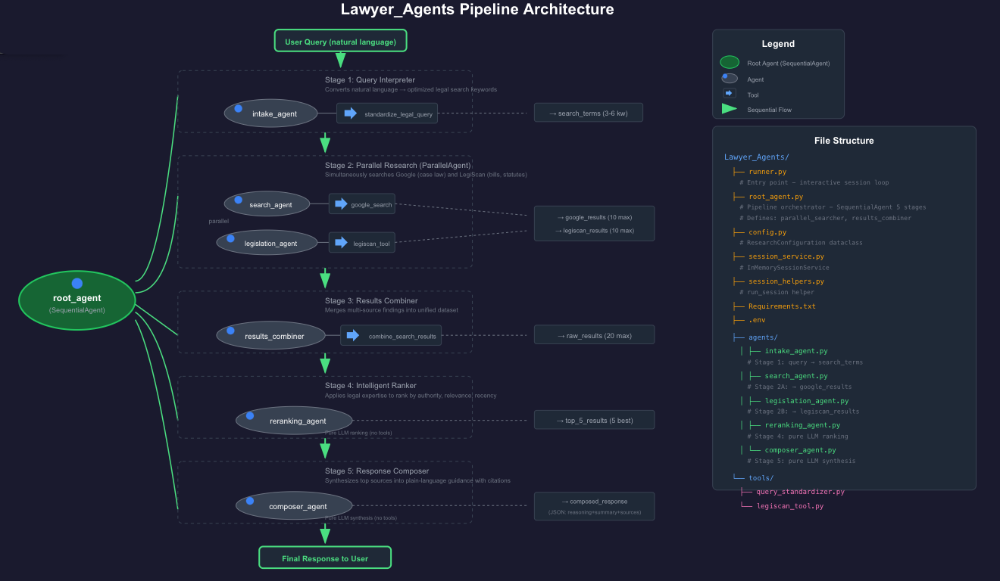

# Lawyer Agents (Enterprise Agents)

**Kaggle Agents Intensive Capstone Project**: (https://www.kaggle.com/competitions/agents-intensive-capstone-project/)

Google ADK powered agents that perform free legal search


---

## Problem Statement

Legal research is a critical but necessary component of legal practice. Attorneys typically spend **3-4 hours per case** manually:
- Searching multiple legal databases that are most times behind a paywall 
- Cross-referencing statutes and regulations
- Validating legal precedents and case law
- Tracking recent legislative updates
- Synthesizing findings into coherent guidance with proper citations

This manual process creates several challenges:
- **Time burden**: Small firms and solo practitioners, like my mother-in-law struggle to balance research with client counseling
- **Cost barrier**: Premium legal databases require expensive subscriptions
- **Information overload**: Sifting through hundreds of search results to find relevant sources
- **Citation complexity**: Ensuring proper legal citation formats and source attribution
- **Recency concerns**: Missing recent bills, rulings, or statutory changes

**Personal Motivation**: Built to help my mother-in-law, a small business attorney who balances her practice with managing multiple businesses. She is also having a hard time adopting AI to speed up her work. Watching her work late into the evenings conducting meticulous legal research inspired me to create a tool that could augment her expertise and help her harness the power of AI. 
---

## Solution Statement

**Lawyer Agents** Automate the legal research workflow through an orchestrated pipeline of specialized AI agents that work in parallel to deliver comprehensive, cited legal guidance in under a minute.

### How It Works

The system uses a **5-stage sequential pipeline** with embedded **parallel agent processing** to:

1. **Interpret Queries**: Converts natural language questions into optimized legal search keywords
2. **Parallel Research**: Simultaneously searches Google (case law, articles) and LegiScan (bills, statutes)
3. **Synthesize Results**: Merges multi-source findings into unified dataset list
4. **Intelligent Ranking**: Applies legal expertise to rank by authority, relevance, and recency
5. **Compose Response**: Synthesizes top sources into plain-language guidance with proper citations

### Key Benefits

- **Time Savings**: Reduces 3-4 hours of manual research to under a minute
- **Comprehensive Coverage**: Searches both public sources (Google) and a free legislative database (LegiScan)
- **Legal Expertise**: AI agents trained to prioritize statutes, recent case law, and authoritative sources
- **Proper Citations**: Automatically cites specific statute numbers, bill codes, and case names
- **Accessibility**: No expensive legal database subscriptions required
- **Plain Language**: Outputs guidance without legal jargon for client-facing use


---

## Architecture Overview



The `root_agent` is a `SequentialAgent` pipeline with five coordinated stages and embedded parallel processing for simultaneous multi-source queries.

### Pipeline Flow

```
User Query (natural language)
    ↓
[Stage 1: Query Interpreter (intake_agent)]
    Agent + standardize_legal_query tool
    ↓ search_terms (3-6 legal keywords)
[Stage 2: Parallel Research (parallel_searcher)]
    ParallelAgent with 2 sub-agents:
    ├─→ [search_agent] (google_search) ──→ google_results (10 items max) ──┐
    └─→ [legislation_agent] (legiscan) ──→ legiscan_results (10 items max) ─┘
                ↓
[Stage 3: Results Combiner (results_combiner)]
    LlmAgent + combine_search_results tool
    ↓ raw_results (combined google_search results + legiscan_results items)
[Stage 4: Intelligent Ranker (reranking_agent)]
    Agent - Gemini-flash LLM ranking by relevance, authority, recency
    ↓ top_5_results (5 best items)
[Stage 5: Response Composer (composer_agent)]
    Agent - Gemini-flash LLM synthesis from sources
    ↓ composed_response (JSON: reasoning + summary + sources)
Final Response to User
```

### Pipeline Stages

**Stage 1: Query Interpreter (`intake_agent`)**
- **Type**: `Agent` with custom tool
- **Tool**: `standardize_legal_query` (from [query_standardizer.py](tools/query_standardizer.py))
- **Purpose**: Converts natural language into 3-6 optimized legal search keywords
- **Example**: "My landlord won't fix mold" → `["mold", "tenant rights", "habitability", "landlord obligations"]`
- **Output**: `search_terms`

**Stage 2: Parallel Research (`parallel_searcher`)**
- **Type**: `ParallelAgent` (runs sub-agents simultaneously inside `root_agent.py`)
- **Purpose**: Multi-source data gathering for comprehensive coverage

  - **Sub-Agent 2A: `search_agent`**
    - Tool: `google_search` (ADK built-in)
    - Searches: Court cases, legal analyses, policy articles, news
    - Output: `google_results` (list of dicts with source, title, description)

  - **Sub-Agent 2B: `legislation_agent`**
    - Tool: `search_legiscan_bills_tool` (custom Function tool)
    - Searches: LegiScan database for bills, statutes, legislative updates
    - Default State: California (configurable)
    - Output: `legiscan_results` (list of dicts with source, title, description)

**Stage 3: Results Combiner (`results_combiner`)**
- **Type**: `LlmAgent` with custom tool
- **Tool**: `combine_search_results` (defined in [root_agent.py])
- **Purpose**: Merges parallel search results from google search and legiscan into unified dataset, preserving original source and description
- **Input**: `google_results`, `legiscan_results`
- **Output**: `raw_results` (~20 combined results)

**Stage 4: Intelligent Ranker (`reranking_agent`)**
- **Type**: `Agent` (Gemini reasoning model)
- **Purpose**: Ranks results by legal-specific criteria and selects top 5
- **Ranking Criteria**:
  - **Relevance**: How well it answers the user's specific question
  - **Clarity**: Usefulness and readability of the result
  - **Legal Authority**: Statutes > Court cases > Articles
  - **Recency**: Newer laws and cases preferred (uses current date)
- **Input**: `search_terms`, `raw_results`
- **Output**: `top_5_results` (5 most authoritative sources, no URL field)

**Stage 5: Response Composer (`composer_agent`)**
- **Type**: `Agent` (Gemini flash)
- **Purpose**: Synthesizes ranked results into structured, user-friendly response
- **Features**:
  - Plain language without legal jargon
  - Specific statute/case citations by name when mentioned in sources
  - Synthesizes information exclusively from provided sources
  - Proper source attribution (no URL field)
  - Includes reasoning field for internal validation
- **Input**: `top_5_results`
- **Output**: `composed_response` (JSON with reasoning, summary, and sources array)


## Custom Tools

### query_standardizer.py
**Purpose**: Generates a prompt for extracting 3-6 optimized legal keywords

**Implementation**: Python function that returns a formatted prompt string

**Function**: `standardize_legal_query(user_query: str) -> str`

**How it works**: Returns a prompt instructing the model to extract legal search terms as a Python list

**Example Transformation**:
```
Input: "My landlord won't fix mold in my apartment"
Output (from agent): ["mold", "tenant rights", "habitability"]
```

**Used by**: `intake_agent` (Stage 1) via `FunctionTool` wrapper

---

### legiscan_tool.py
**Purpose**: LegiScan API integration for free legislative research

**Function**: `search_legiscan_bills(query: str, state: str = "CA") -> List[Dict]`

**Features**:
- Queries LegiScan REST API using the `getSearch` operation
- Default state: California (configurable via `state` parameter)
- Returns max of top 10 bills with titles and descriptions
- Error handling with fallback error message

**API Integration**:
- Base URL: `https://api.legiscan.com/`
- Requires `LEGISCAN_API_KEY` environment variable

**Output Format**:
```json
{
  "source": "LegiScan",
  "title": "CA AB-2173: Residential Mold Disclosure Requirements",
  "description": "Assembly Bill 2173 (2024) enhances landlord disclosure..."
}
```

**Export**: `search_legiscan_bills_tool = FunctionTool(search_legiscan_bills)`

**Used by**: `legislation_agent` (Stage 2B)

---

### Session Management
**Files**:
- [session_service.py](session_service.py) - Service configuration
- [session_helpers.py](session_helpers.py) - Helper utilities
- [runner.py](runner.py) - Interactive session implementation

**Implementation**: `InMemorySessionService` from Google ADK

**Configuration**:
- `APP_NAME = "lawyer_agent"`
- `USER_ID = "default"`

**Features**:
- Multi-turn conversation support
- Maintains context across queries
- Interactive mode with continuous conversation loop
- Session stored in RAM (temporary)

**Usage in runner.py**:
- Creates `Runner` with root agent and session service
- Interactive mode: Type 'exit' or 'quit' to end session
- Session ID: "interactive-session"

**Future Enhancement**: Persistent storage for long-running projects

---

## Key Design Decisions

### Why Parallel Research?
Legal research requires checking multiple authoritative sources. Running `search_agent` (Google) and `legislation_agent` (LegiScan) in parallel:
- **Cuts research time in half** (2x speedup)
- **Ensures comprehensive coverage** (public sources + legislative databases)
- **Improves result diversity** (case law + statutes + articles)

### Why Results Combiner?
The reranking agent expects a single unified dataset. The combiner uses the `combine_search_results` tool to merge parallel outputs into `raw_results` for downstream processing. This is a simple concatenation (`google_results + legiscan_results`) that preserves source and description without modification.

### Why Reranking?
Search APIs return results by generic relevance, not legal-specific criteria. The reranking agent applies domain expertise to:
- Prioritize clarity and usefulness of the result
- Favor legal authority (statutes > cases > articles)
- Match user's specific search terms
- Output 5 most valuable results - for comprehensive search

### Why Composer?
Raw search results are disconnected snippets. The composer:
- Synthesizes them into cohesive narrative using only provided sources
- References bills and cases by name when mentioned in sources
- Translates to plain language without legal jargon
- Includes reasoning field for internal validation
- Ensures no hallucination (exclusively uses information from top_5_results)
- Outputs structured JSON with reasoning, summary, and sources array (no URLs)

---


## Technical Stack

- **Framework**: Google Agent Development Kit (ADK) v0.1.0+
- **Models**: Gemini 2.5 Flash (`gemini-2.5-flash`) and Gemini 2.5 Pro (`gemini-2.5.pro`)
- **Platform**: Google Cloud Vertex AI
- **APIs**:
  - LegiScan REST API (legislative database) - `https://api.legiscan.com/`
  - Google Search (ADK built-in tool)
- **Dependencies**:
  - `google-adk>=0.1.0`
  - `google-genai>=1.0.0`
  - `requests>=2.31.0`
  - `python-dotenv>=1.0.0`

---

## Project Structure

```
Lawyer_Agents/
├── runner.py                    # Application entry point - interactive session loop
├── root_agent.py                # Pipeline orchestrator - SequentialAgent with 5 stages
│                                # Defines: parallel_searcher, results_combiner,
│                                # combine_search_results function
├── config.py                    # Configuration - ResearchConfiguration dataclass
│                                # Sets worker_model to "gemini-2.5-flash"
├── session_service.py           # Session management - InMemorySessionService
│                                # APP_NAME="lawyer_agent", USER_ID="default"
├── session_helpers.py           # Session utilities - run_session helper
├── Requirements.txt             # Python dependencies
├── .env                         # Environment variables (API keys, GCP config)
├── agents/
│   ├── intake_agent.py          # Stage 1: user input → search_terms
│   │                            # Uses: standardize_legal_query FunctionTool
│   ├── search_agent.py          # Stage 2A: search_terms → google_results
│   │                            # Uses: google_search (ADK built-in)
│   ├── legislation_agent.py     # Stage 2B: search_terms → legiscan_results
│   │                            # Uses: search_legiscan_bills_tool
│   ├── reranking_agent.py       # Stage 4: search_terms + raw_results → top_5_results
│   │                            # No tools, pure LLM ranking
│   └── composer_agent.py        # Stage 5: top_5_results → composed_response
│                                # No tools, pure LLM synthesis
└── tools/
    ├── query_standardizer.py    # standardize_legal_query() - prompt generator
    └── legiscan_tool.py         # search_legiscan_bills() - LegiScan API client
                                 # Exports: search_legiscan_bills_tool
```

---

## Installation

### Requirements
- Python 3.11.3+

### Setup

```bash
# Create virtual environment (recommended)
python -m venv venv
source venv/bin/activate  # On Windows: venv\Scripts\activate

# Install dependencies
pip install -r Requirements.txt
```

### Environment Configuration

Create `.env` file in project root:

```bash
# Google Cloud / Vertex AI Configuration
GOOGLE_GENAI_USE_VERTEXAI=True
GOOGLE_CLOUD_PROJECT=lawyer-agents
GOOGLE_CLOUD_LOCATION=global

# API Keys
GOOGLE_API_KEY=your_google_api_key_here
LEGISCAN_API_KEY=your_legiscan_api_key_here
```

**Note**: Default values for `GOOGLE_GENAI_USE_VERTEXAI`, `GOOGLE_CLOUD_PROJECT`, and `GOOGLE_CLOUD_LOCATION` are set in [config.py](config.py) and can be overridden via `.env`.

**API Keys**:
- **Google API**: [Google Cloud Console](https://console.cloud.google.com/)
- **LegiScan API**: [LegiScan.com](https://legiscan.com/legiscan)

### Usage

```bash
python runner.py
```

**Interactive Mode**:
- Type your legal questions at the `User >` prompt
- Type `exit` or `quit` to end the session
- Press `Ctrl+C` to interrupt at any time
- Session maintains context for follow-up questions

**Notes**:
- `runner.py` loads environment variables via `load_dotenv()` before importing root agent
- Google Auth warnings about quota project are suppressed via `warnings.filterwarnings()`

---

## Example Query

### Tenant Rights 
**Query:**
```
"My landlord won't fix mold in my apartment. What are my rights?"
```

**Pipeline Processing:**
- **search_terms**: `["mold", "tenant rights", "habitability", "landlord obligations"]`
- **top_5_results**: CA Civil Code § 1941.1, CA AB-2173, Green v. Superior Court, CA Health & Safety Code § 26147, Tenant Rights Guide
- **composed_response**: Structured guidance with statute citations, remedies (repair-and-deduct, rent withholding), and action steps

**Output Summary:**
```
Summary of habitability laws, CA Civil Code § 1941.1 references, recent AB-2173
disclosure requirements, Green v. Superior Court case law, actionable next steps
with documentation requirements
```

---

## Performance Characteristics

- **Average Query Time**: Under a minute (including parallel search)
- **Time Saved vs Manual Research**: 3-4 hours per case

---


## License

Provided for educational purposes as part of the Kaggle Agents Capstone project.

